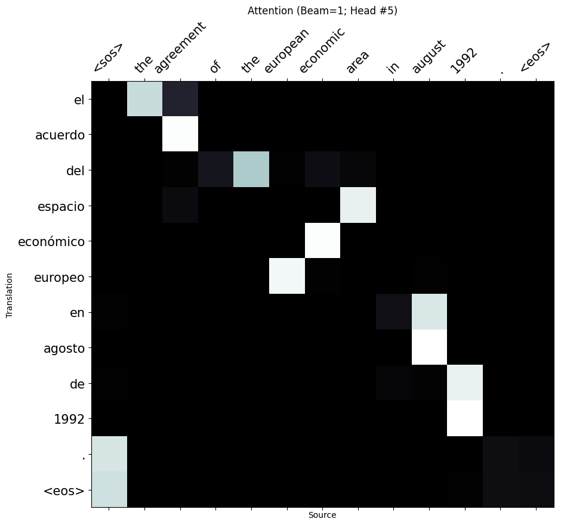
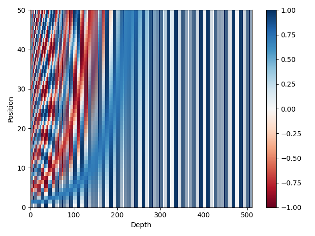

# MLTests

Backup for my ML tests

### Pretty stuff

**Transfomer Attention (`beam_width=1; head=5`):**



**Positional encoding (static):**




### Good to know stuff

**Toy model:**

We can we up to 2% extra in BLEU by using a wider beam. Not much difference from 5 and on.

```
# Beam 1
2020-11-16 11:43:29 | INFO | fairseq_cli.generate | NOTE: hypothesis and token scores are output in base 2
2020-11-16 11:43:29 | INFO | fairseq_cli.generate | Translated 3000 sentences (117786 tokens) in 8.4s (357.45 sentences/s, 14034.35 tokens/s)
Generate test with beam=1: BLEU4 = 30.60, 58.9/37.7/25.9/19.0 (BP=0.945, ratio=0.947, syslen=114786, reflen=121236)

# Beam 5
2020-11-16 11:38:09 | INFO | fairseq_cli.generate | NOTE: hypothesis and token scores are output in base 2
2020-11-16 11:38:09 | INFO | fairseq_cli.generate | Translated 3000 sentences (115935 tokens) in 14.8s (202.89 sentences/s, 7840.55 tokens/s)
Generate test with beam=5: BLEU4 = 32.24, 61.2/40.1/28.2/21.0 (BP=0.929, ratio=0.932, syslen=112935, reflen=121236)

# Beam 32
2020-11-16 11:42:32 | INFO | fairseq_cli.generate | NOTE: hypothesis and token scores are output in base 2
2020-11-16 11:42:32 | INFO | fairseq_cli.generate | Translated 3000 sentences (114388 tokens) in 72.3s (41.47 sentences/s, 1581.32 tokens/s)
Generate test with beam=32: BLEU4 = 32.26, 61.6/40.7/28.7/21.5 (BP=0.915, ratio=0.919, syslen=111388, reflen=121236)
```


### Useful commands

```
python -m pip install --upgrade pip
pip install -U --use-feature=2020-resolver -r requirements.txt 
tensorboard --logdir ./lightning_logs
```

## Fairseq

1. Run "fairseq/preprocessed"

2. Apply FastBPE:

```
size=32000
src=en
trg=es
fast learnbpe $size train.tok.$src train.tok.$trg > codes

fast applybpe train.$size.$src train.$src codes
fast applybpe train.$size.$trg train.$trg codes

fast applybpe dev.$size.$src dev.$src codes
fast applybpe dev.$size.$trg dev.$trg codes

fast applybpe test.$size.$src test.$src codes
fast applybpe test.$size.$trg test.$trg codes
```

3. Preprocessed data (fairseq)

```
DATASET_NANE=miguel
TEXT=examples/translation/$DATASET_NANE
fairseq-preprocess --source-lang $src --target-lang $trg --trainpref $TEXT/train --validpref $TEXT/dev --testpref $TEXT/test --destdir data-bin/$DATASET_NANE --tokenizer moses --bpe fastbpe --workers 16
```


4. Train (fairseq)

```
CHECKPOINTS_PATH=checkpoints/fconv/
mkdir -p $CHECKPOINTS_PATH
CUDA_VISIBLE_DEVICES=0 fairseq-train data-bin/$DATASET_NANE --lr 0.001 --clip-norm 0.1 --dropout 0.2 --max-tokens 4000 --arch fconv_iwslt_de_en --optimizer adam --lr-scheduler reduce_lr_on_plateau --tensorboard-logdir runs/ --num-workers 8 --log-format tqdm --save-dir $CHECKPOINTS_PATH --no-epoch-checkpoints
```

5. Interact (fairseq)

```
# Create new folder a copy to it, these files: checkpoint_best (checkpoints), codes (examples), dict.src.txt, dict.trg.txt (data-bin)
$MODEL_DIR=...
fairseq-interactive --path $MODEL_DIR/checkpoint_best.pt $MODEL_DIR --beam 5 --source-lang $src --target-lang $trg --tokenizer moses --bpe fastbpe --bpe-codes $MODEL_DIR/codes
```

6. Generate (fairseq)

```
fairseq-generate data-bin/$DATASET_NANE --path $CHECKPOINTS_PATH/checkpoint_best.pt --batch-size 128 --beam 5
```

